# Overview
My Office Space is a site where hybrid work is the new norma. People has move to remote locations, starting new business and etc. 
My Office Space allows people to rent an office space when they want, which means they don't pay for used office space.

The site is a work in progress and require many more enhancements which will be completed in the future. it offer the basic functions where a user can book a space and delete when needed.

Link to live site https://myofficespace.herokuapp.com


## Data model

The data modal design was to keep it simple to create an MVP application which could be expanded in future.


# User Experience (UI/UX Design)

## Wireframes

Wireframe provided the an idea on how the layout of the application would look like as a finished product

### Homepage

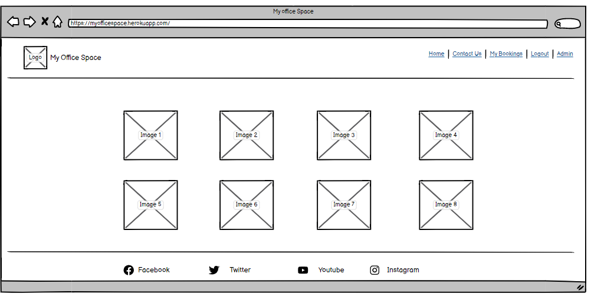

### Login

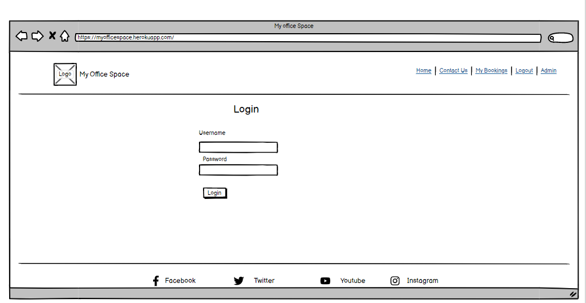

### Contact Us

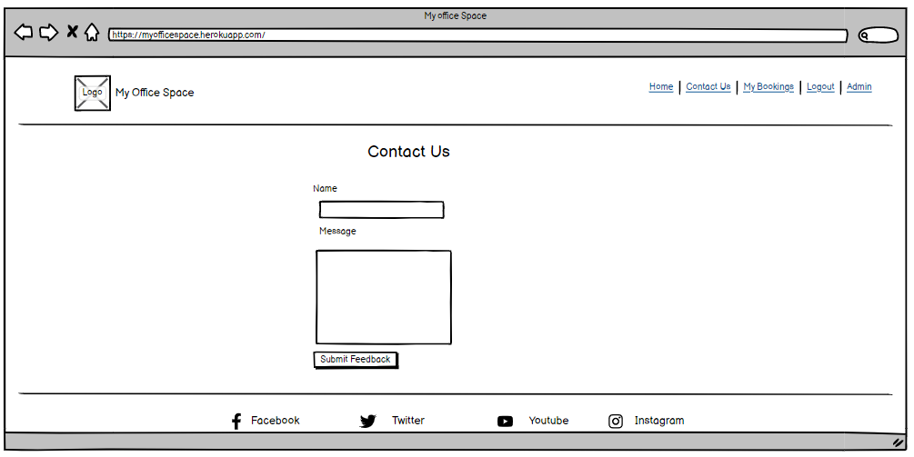

### My Bookings

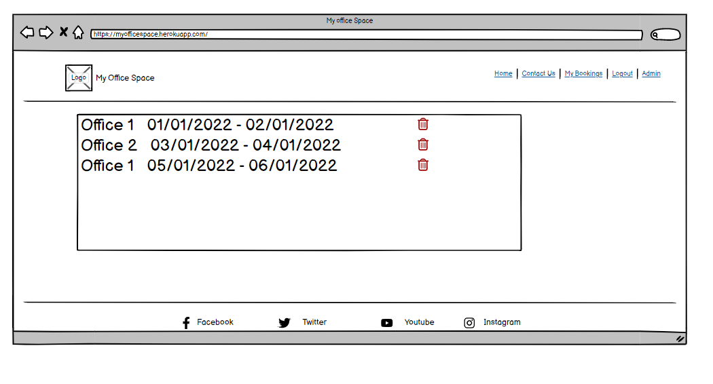

## Responsive design

Keeping the design simple and easy to following. the site is compatible with all devices.

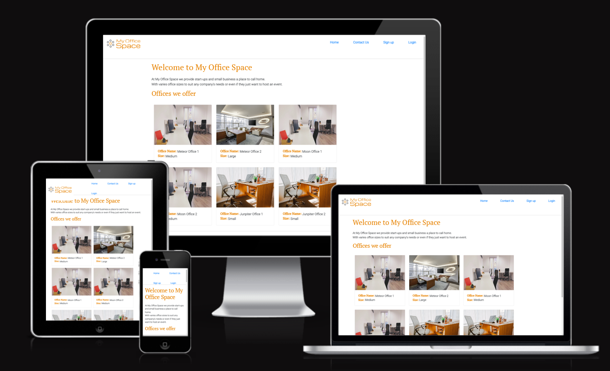

### Homepage (Unauthenticated User)

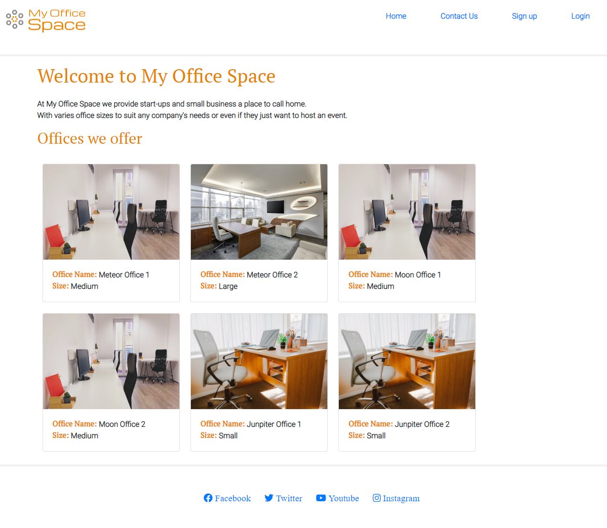

### Homepage (Authenticated User)

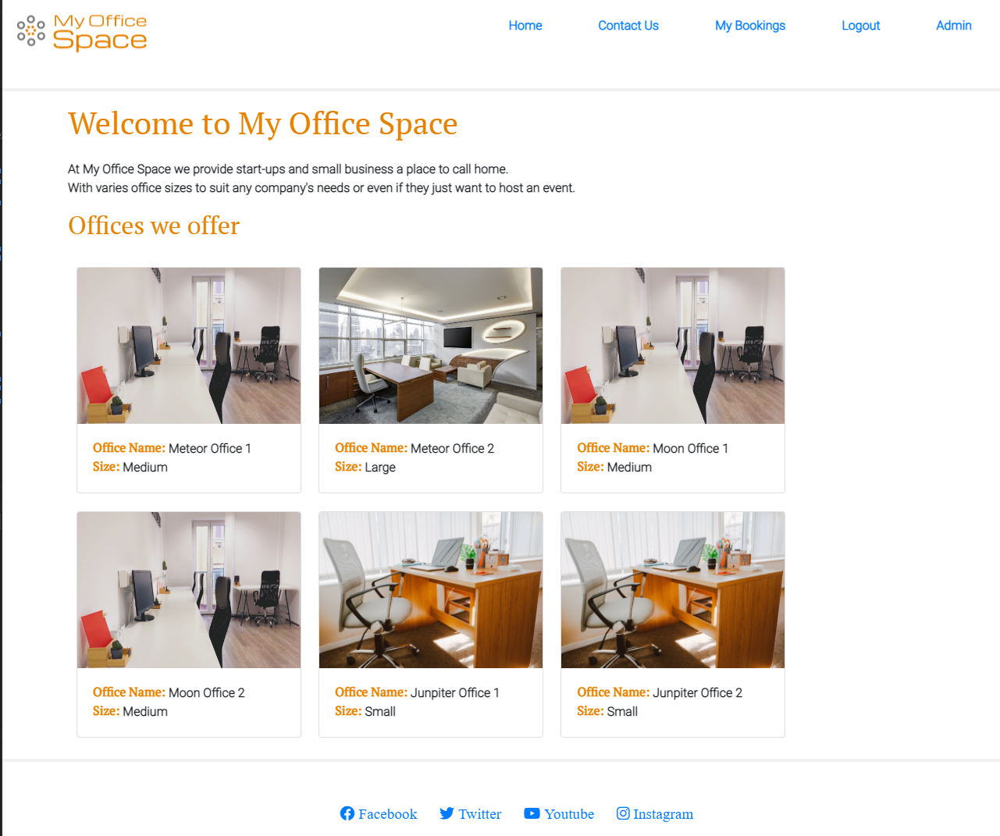

### My Bookings

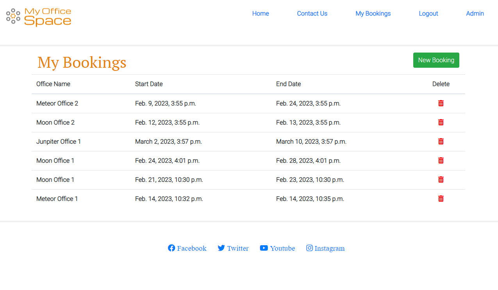

### Booking

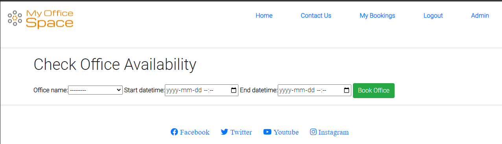

### Contact Us

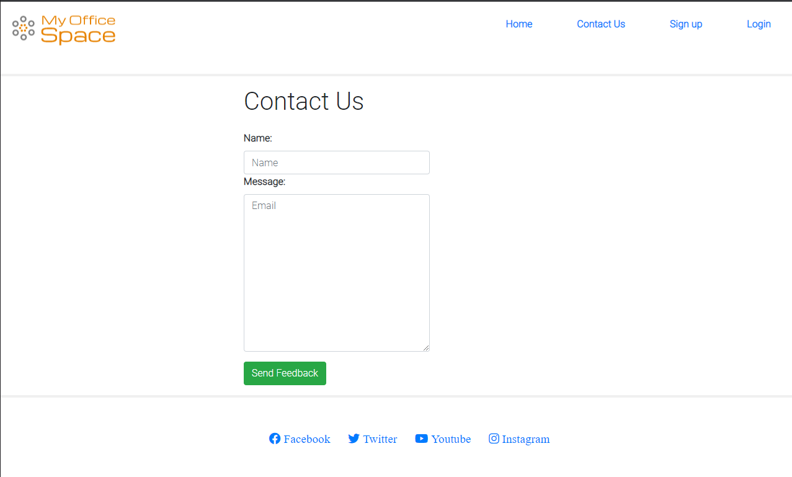

### Login

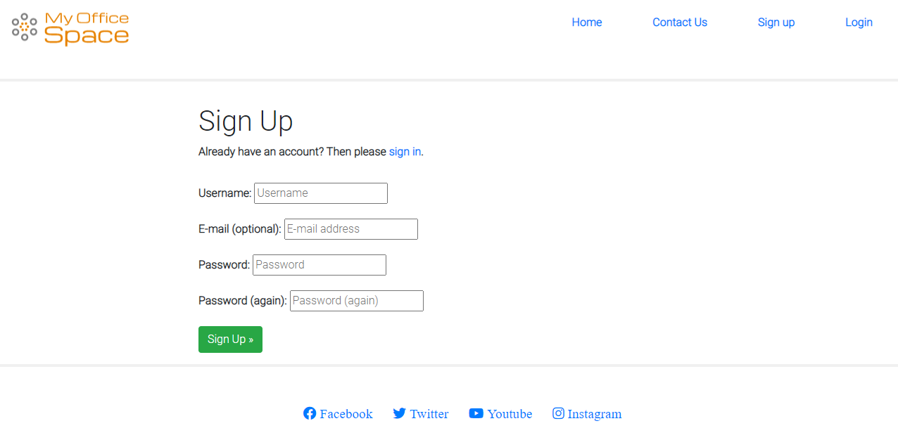

### Sign Up


### Page Not Found

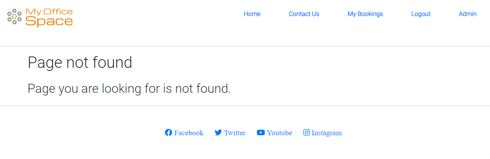

## Logo

Logo was created by a free online tool, I have placed the link in the credits. They are very basic designs but great for personal website projects


## Colors

Fulvous is the main color for the site with a gray web as the secondary font


## Fonts

San Serif and Roboto is main font selected for the selected to have for this site.

# Testing

Basic test were perform to ensure users can create an account, booking and delete their bookings.

Booking confirmation

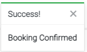

Booking Error


Login Successful

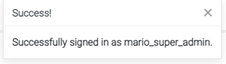

Logout Successful

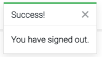

# Deployment

The game was deployed to Heroku without any errors.
As it was only my second time deploying to Heroku, used the Code Institute Love Sandwiches walk through as a reminder. 

I ensure I added my creds.json to the .gitignore file is ensure the sensitive information is not pushed to Github

Was the code was ready and tested I run the ``` pip freeze > requirements.txt ```
Once completed I published everything to GitHub using the commands below

- ``` git add . ```
- ``` git commit -m "{My commit message}" ```
- ``` git push```

- Set Debug to False in Setting.py file in project folder
- Logged in to Heroku
- Created a new app
- Provided a name of the App and selected a Region of Europe
- Selected the Settings Tab
- Under Build Packs I added Python and NodeJS in that order
- Added my 2 config Vars, listed below
  + Cloudinary_URL: set to my cloudinary://[Link]
  + PORT, VALUE: 8000
  + DATABASE_URL: URL TO DB
  + RECAPTCHA PRIVATE AND PUBLIC KEY ( Not implemented.)
  + Sercet _key: [My Secret Key]
- Selected the Deploy Tab
- As my GitHub was already linked, I search for my repository for my project
- Once linked I clicked on Deploy Branch under the Manual Deployment section

# Technologies Used

* HTML
    * HTML was used to setup the core structure of the game. This was provided in the Code Institute Github Template  
* CSS
    * CSS stylesheet was used to style the website and gaming feature. This was provided in the Code Institute Github Template 

* GitPod
    * A GitPod Workspace was used to code the website. Using Code Institute GitHub Template some other predefined technologies are installed to allow developers to integrate to Git for versioning and Python3
* GitHub
    * Github was used to store our committed Source Code and have a live website using GitHub Pages.
* Git 
    * Version control, integrated with GitPod
* Python
    * Python is the language used to create the booking functions and views with Django
* Django
    * Django provides a frameworks to build our sites which has hosts of modules that can be imported to speed up development
* Cloudinary
    * Hosting platform for all our media and static files
* Google ReCaptcha
    * to validate that robots are not performing action on the site. The integration of this function is not completed yet on the site. this feature was not implemented.
* Built in PostgreSQL
    * Database which hold the all records on bookings and user sign in credentials.

# Credits

- Logo design
 - https://www.freelogodesign.org/ site was used to generate a free logo for the site. I had to select i design I liked and would match the color scheme for the site.
 - https://stackoverflow.com/questions/56860065/date-validation-end-date-must-be-greater-than-start-date - https://www.geeksforgeeks.org/django-creating-a-404-error-page/
 - https://github.com/fabiocaccamo/django-admin-interface
 - Photo by Lisa Fotios: https://www.pexels.com/photo/office-chair-and-desk-1957477/
 - Photo by David: https://www.pexels.com/photo/black-office-rolling-chair-beside-white-wooden-table-3712597/
 - Photo by Pixabay: https://www.pexels.com/photo/gray-office-rolling-chair-near-brown-wooden-desk-in-front-of-flat-screen-tv-on-white-painted-wall-37347/
 - Code Institute for provide the training and their videos help building the site on a very tight timeline.
 - Darshan Dev -Youtube videos which helped with booking logics https://www.youtube.com/watch?v=-9dhCQ7FdD0&list=PL_6Ho1hjJirn8WbY4xfVUAlcn51E4cSbY
 - Code Institute module on Toast messages on the Ado Boutique walk through.